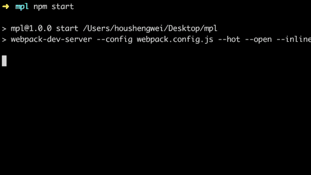

# webpack-assets-upload-plugin
A webpack plugin which can help you upload boundle assets to you server by use ssh

When you use `web-dev-server`, maybe you wanner do something at everytime webpack compiled,just like upload boundle assets to you server...



### USAGE

+ Install

  ```bash
    npm install --save-dev webpack-assets-upload-plugin
  ```
+ Upload boundle assets to you server.

  ```bash
    # webpack.config.js
    const Upload = require('webpack-assets-upload-plugin')

    ...
    plugins: [
      new Upload({
        remotePath: '/you/taget/path',
        host: 'host',
        port: 'port || 22',
        username: 'username',
        password: 'password'
      })
    ]
    ...
  ```

+ Do something else.

  ```bash
    # webpack.config.js
    const Upload = require('webpack-assets-upload-plugin')

    ...
    plugins: [
      /**
       * [tasks description]
       * @param  {[Array]} boundleAssets [assets collection]
       * @param  {[string]} asset.filename [filename for asset]
       * @param  {[string]} asset.source [file content for asset]
       */
      new Upload(function tasks (boundleAssets) {
        // do something...
      })
    ]
    ...
  ```
### CHANGELOG

+ Add support for old version of webpack.
+ Add examples of webpack v2.
+ fixed windows path step